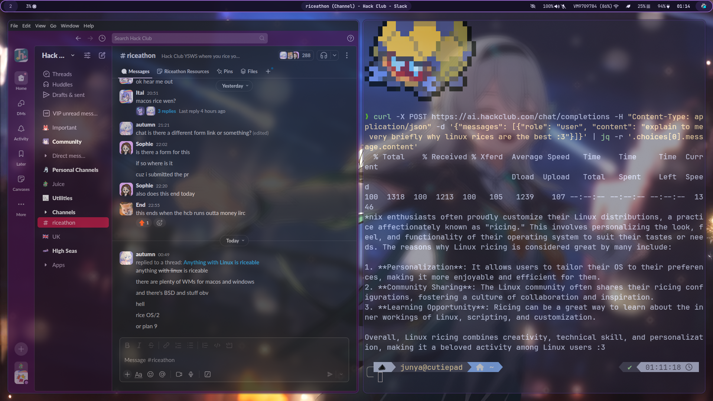

# junya's dotfiles

this is the repo containing the dotfiles for my first linux rice with a Firefly HSR theme :3

# showtime




# installation

⚠️ **Note**: this script is only for arch-based distros ⚠️

⚠️ **Note**: i also haven't tested this script (yet...) so if it breaks then uh idk

```bash
$ git clone https://github.com/junyali/dotfiles
$ cd dotfiles
$ chmod +x install.sh
$ ./install.sh
```
